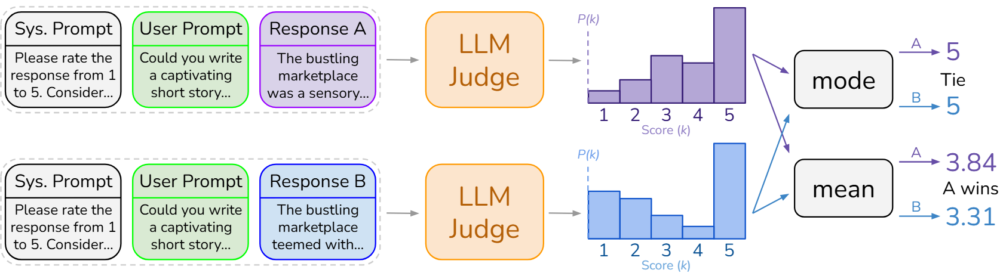

# Improving LLM-as-a-Judge Inference with Distributional Judgment

## Abstract

Using language models to scalably approximate human preferences on text quality (LLM-as-a-judge) has become a standard practice applicable to many tasks. A judgment is often extracted from the judge's textual output alone, typically with greedy decoding. However, LLM judges naturally provide _distributions_ over judgment tokens, inviting a breadth of inference methods for extracting fine-grained preferences. We find that taking the mean of the judgment distribution consistently outperforms taking the mode (i.e. greedy decoding) in all evaluation settings (i.e. pointwise, pairwise, and listwise). We further explore novel methods of deriving preferences from judgment distributions, and find that methods incorporating risk aversion often improve performance. Lastly, we analyze LLM-as-a-judge paired with chain-of-thought (CoT) prompting, showing that CoT can collapse the spread of the judgment distribution, often harming performance. Our findings suggest leveraging distributional output can improve LLM-as-a-judge, as opposed to using the text interface alone.
